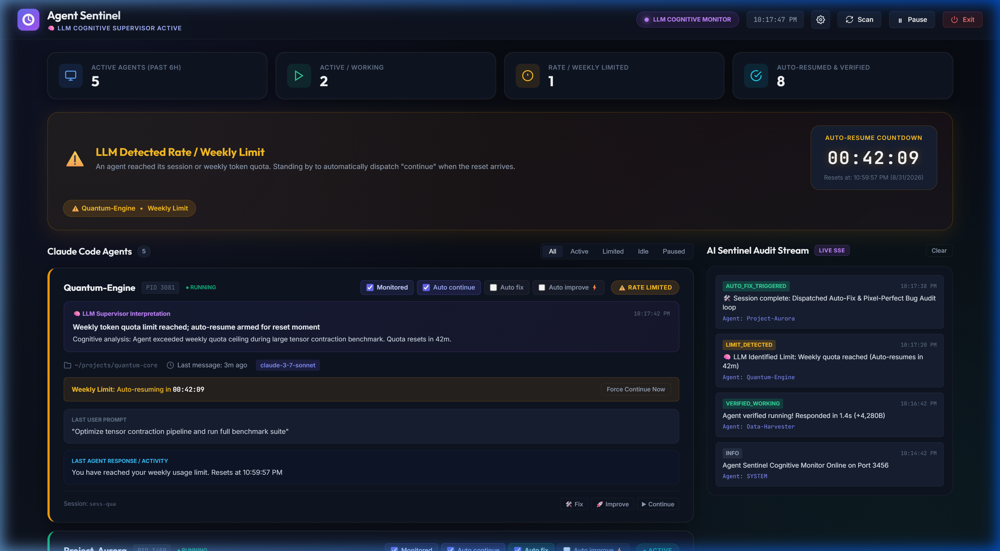
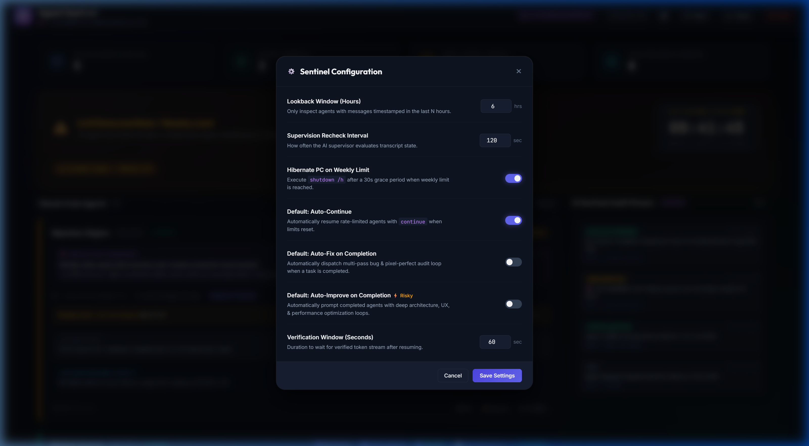

# Agent Sentinel 🛡️🧠

**AI Cognitive Supervisor, Autonomous Resumption Engine & Rate Limit Sentinel for Claude Code Agents.**

[](https://nodejs.org)
[](https://opensource.org/licenses/MIT)
[](#)
[](#how-it-works)

---



Agent Sentinel is an intelligent supervisory dashboard and autonomous daemon designed for multi-agent **Claude Code** development workflows (with extensible architecture for additional agent runtimes). Executable by any AI coding assistant (Antigravity, Cursor, Windsurf, Claude Code, etc.) or run as a standalone service, Agent Sentinel uses continuous **LLM Cognitive Supervision** to analyze transcript semantics, distinguish between active execution and true rate limits, automatically issue resume instructions (*"continue"*), autonomously trigger bug-free hardening reviews upon task completion, and optionally hibernate your machine on weekly quota exhaustion.

---

## 🌟 Key Features

### 1. 🧠 LLM Cognitive Supervision (No Naive Regexes)
- Evaluates raw conversation turns using continuous LLM reasoning.
- Accurately differentiates between task completion, active tool execution, momentary network hiccups, 5-hour session ceilings, and weekly subscription limits.
- Renders an explicit **"🧠 LLM Supervisor Interpretation"** card on each agent with step-by-step diagnostic reasoning.

### 2. 🤖 Three Autonomous Prompting Modes
Configure behavior globally in Settings or override per agent:

1. **Auto Continue (`continue`)** *(Enabled by default)*:
   - Automatically triggered when an agent reaches its quota/rate limit reset timestamp.
2. **Auto Fix (The Ultimate Adversarial Bug-Free & Pixel-Perfect Hardening Loop)**:
   - When an agent finishes its goal, Sentinel automatically dispatches an iterative multi-pass audit loop:
     > *"Perform an exhaustive adversarial code & visual hardening audit:*
     > *1. Multi-Dimensional Adversarial Review: Adopt a red-team mindset (or spawn adversarial subagents) to stress-test edge cases, input validation, concurrency boundaries, and verify strict adherence to specifications without charitable assumptions.*
     > *2. Bug & Functional Integrity: Meticulously review all modified/related files to guarantee 100% bug-free behavior, type safety, test passing, and edge-case resilience.*
     > *3. Pixel-Perfect Visual & UX Scrutiny: Inspect UI components, styles, animations, and layouts for responsiveness and visual polish.*
     > *4. Regression & Diff Verification: Inspect git diffs to ensure zero regressions and no unintended side effects.*
     > *5. Multi-Pass Convergence Loop: Continue independent review passes in a loop until no further issues or improvements remain."*
3. **Auto Improve (Deep Architecture, Performance & Polish Optimization — Risky)**:
   - When enabled, automatically prompts completed agents for deep latency profiling, memory optimization, modular refactoring, resilience edge-case guards, and UX/UI refinement.

### 3. 🎛️ Per-Agent Granular Controls
- Interactive checkboxes right on each agent card header:
  - ☑️ **`Monitored`**: Toggle active supervisor monitoring for this session.
  - ☑️ **`Auto continue`**: Auto-resume when quota limits expire.
  - ☐ **`Auto fix`**: Auto-dispatch the multi-pass bug audit upon task completion.
  - ☐ **`Auto improve ⚡`**: Auto-dispatch architectural & performance optimization upon completion.
- Quick on-demand action chips (`🛠️ Fix`, `🚀 Improve`, `▶ Continue`).

### 4. ⏳ Rate Limit Intelligence & Live Countdown
- Calculates timezone-aware reset moments (e.g., *"resets at 5:00 PM EST"* or *"resets Monday at 9:00 AM"*).
- Displays a prominent **Auto-Resume Countdown** hero widget on the dashboard.

### 5. ⚡ Resumption Verification Engine
- Monitors transcript byte growth and active token streams over a 60-second window before confirming **VERIFIED RUNNING**.

### 6. 💤 Intelligent Windows Hibernation (Optional)
- When enabled, if an agent exhausts its **weekly quota limit**, Sentinel arms a **30-second warning banner** with a live countdown and an immediate **"Cancel Hibernation"** button.
- If not canceled, it cleanly executes Windows hibernation (`shutdown /h`) to conserve system power until your quota resets.

### 7. ⚙️ Centralized Settings Modal
- Configure lookback windows, recheck delays, global default toggles for Auto-Continue, Auto-Fix, and Auto-Improve, and verification timeouts directly from the web interface.



### 8. ⏱️ True Message Timestamp Filtering
- Inspects the **actual ISO timestamps of conversation turns** rather than filesystem `mtime`.
- Prevents external tools (Dropbox sync, antivirus scans, Calibre library indexes) from falsely pulling stale sessions into your active monitoring view.

---

## 🚀 Quick Start

### Method A: AI Assistant / Pair-Programming Agent Pairing (Recommended)
1. Open this repository in your AI coding environment (Google Antigravity, Cursor, Claude Code, Windsurf, etc.):
   ```
   C:\Users\erwin\Dropbox\Projects\GitHub\Agent-Sentinel
   ```
2. Ask your AI assistant to **`start monitoring`** or **`proceed`**.
3. The AI agent will automatically start the background Sentinel server, discover your active agents, perform cognitive interpretations, and open the dashboard at **[http://localhost:3456](http://localhost:3456)**!

---

### Method B: Standalone Daemon
1. Clone or navigate to the directory:
   ```bash
   cd C:\Users\erwin\Dropbox\Projects\GitHub\Agent-Sentinel
   ```
2. Start the Sentinel server (zero external dependencies required):
   ```bash
   npm start
   ```
3. Open your browser to **[http://localhost:3456](http://localhost:3456)** (or **[http://localhost:3456/?demo=true](http://localhost:3456/?demo=true)** for sanitized demo mode).

---

## ⚙️ Configuration (`config.json`)

All settings can be toggled in the UI via the **Settings Cog ⚙️** or edited directly in `config.json`:

| Parameter | Type | Default | Description |
| :--- | :--- | :--- | :--- |
| `lookbackHours` | `number` | `6` | Lookback window in hours for active Claude Code sessions. |
| `recheckIntervalSeconds` | `number` | `120` | Interval in seconds between cognitive supervision cycles. |
| `hibernateOnWeeklyLimit` | `boolean` | `false` | If `true`, triggers a 30s grace countdown followed by `shutdown /h` upon weekly limit detection. |
| `hibernateOnAllCompleted` | `boolean` | `false` | If `true`, triggers a 30s grace countdown followed by `shutdown /h` upon completion of all active agents. Armed only if an agent was active when enabled. |
| `defaultAutoContinue` | `boolean` | `true` | Default policy for automatically resuming rate-limited agents. |
| `defaultAutoFix` | `boolean` | `false` | Default policy for dispatching the bug-free & pixel-perfect audit upon task completion. |
| `defaultAutoImprove` | `boolean` | `false` | Default policy for dispatching deep optimization & polish loops upon task completion. |
| `verificationTimeoutSeconds` | `number` | `60` | Time to wait for verified agent token stream before timing out. |
| `disabledSessionIds` | `string[]` | `[]` | Array of session UUIDs paused by the user. |
| `agentOverrides` | `object` | `{}` | Per-agent feature overrides (`autoContinue`, `autoFix`, `autoImprove`). |

---

## 📡 REST & Real-Time SSE API

| Endpoint | Method | Description |
| :--- | :--- | :--- |
| `/api/status` | `GET` | Returns full system telemetry, active agent states, config, and hibernation status. |
| `/api/stream` | `GET (SSE)` | Real-time Server-Sent Events stream for live state updates and audit events. |
| `/api/raw-agent-context` | `GET` | Returns recent conversation turns and raw metadata for LLM evaluation. |
| `/api/supervisor/submit-evaluation` | `POST` | Submits LLM cognitive diagnostic verdicts and updates agent cards. |
| `/api/toggle-agent` | `POST` | Enables or pauses monitoring for a given `sessionId`. |
| `/api/toggle-agent-feature` | `POST` | Sets per-agent overrides for `autoContinue`, `autoFix`, or `autoImprove`. |
| `/api/trigger-agent-action` | `POST` | Manually triggers `continue`, `autofix`, or `autoimprove` on an agent. |
| `/api/config` | `POST` | Updates global configuration settings. |
| `/api/cancel-hibernation` | `POST` | Immediately aborts an active hibernation countdown. |
| `/api/resume-agent` | `POST` | Manually dispatches a *"continue"* command to an agent. |
| `/api/scan` | `POST` | Triggers an immediate filesystem scan across Claude Code workspaces. |
| `/api/shutdown` | `POST` | Gracefully shuts down the Sentinel daemon. |

---

## 🏗️ Architecture

```mermaid
flowchart TD
    subgraph Claude_Code [Claude Code Ecosystem]
        C1[Agent 1: Feature Work]
        C2[Agent 2: Test Suite]
        C3[Agent 3: Long Build]
        JSONL[(Transcripts & Sessions)]
        C1 --> JSONL
        C2 --> JSONL
        C3 --> JSONL
    end

    subgraph Agent_Sentinel [Agent Sentinel Backend]
        Scanner[Message-Level Timestamp Scanner]
        JSONL --> Scanner
        Scanner --> StateEngine[In-Memory Sentinel State]
        StateEngine --> SSE[Server-Sent Events Stream]
        StateEngine --> API[REST Endpoints]
        Resumer[Resume & Autonomous Prompt Engine]
        Hibernator[Power & Hibernation Controller]
    end

    subgraph Cognitive_Supervisor [AI Cognitive Layer]
        LLM[Any AI Supervisor (Antigravity, Claude, Gemini, GPT, etc.)]
        API -->|Raw Context| LLM
        LLM -->|Cognitive Diagnostics| API
    end

    subgraph User_Dashboard [Dashboard UI (localhost:3456)]
        UI[Glassmorphic Web App]
        SSE --> UI
        UI -->|Manual Overrides / Toggles / Config| API
    end

    StateEngine --> Resumer
    Resumer -->|Continue / Auto-Fix / Auto-Improve| Claude_Code
    StateEngine --> Hibernator
    Hibernator -->|shutdown /h| OS[(Windows 11)]
```

---

## 📄 License
MIT © Erwin Mayer
